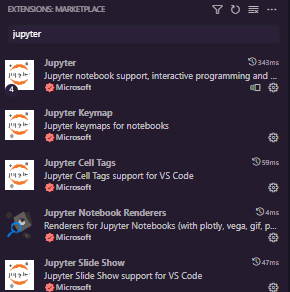
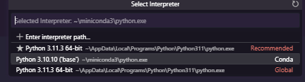
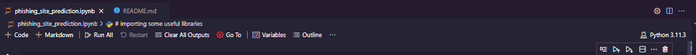
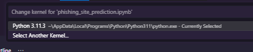
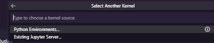
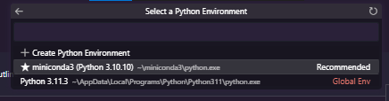

tutorial instalasi environment :

https://youtu.be/BtJR4uhy934?si=7pf-oe-3d8JsZQEe

Download dataset :
https://www.kaggle.com/datasets/taruntiwarihp/phishing-site-urls/download?datasetVersionNumber=1

setelah download, extract lalu pindahkan file `.csv` ke dalam folder ini

Abis tu bisa langsung bukak vscode, buka file `phising_site_prediction.ipynb` nya

Lalu install beberapa ekstension :

Ctrl + shift + P lalu ketik "select interpreter"

Pilih Conda

Tunggu sebentar

atau bisa juga click python di pojok atas kanan untuk mengganti interpreter ke Conda

select another kernel

pilih python environment

pastikan pilih miniconda

ok sekarang sudah bisa untuk menjalankan notebook file `.ipynb` kita. Caranya bisa langsung klik tanda panah disamping cell atau shift + enter di dalam cell
